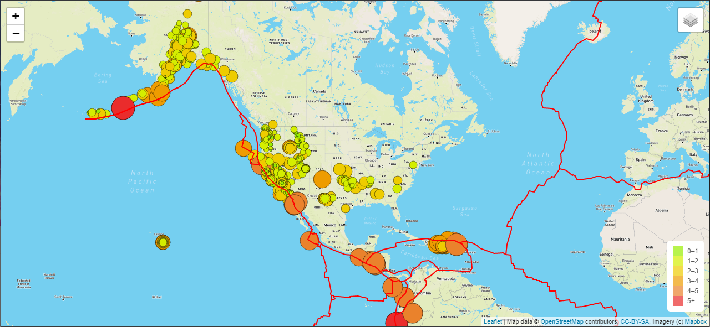

# Mapping_Earthquakes

## Overview
Basil and Sadhana appreciated how we created the earthquake maps with two maps and the earthquake overlay. For the next challenge, both Basil and Sadhana would like to see the earthquake data's relationship with tectonic plate locations. Also, they would like to see magnitudes greater than 4.5 on the map and displayed on a third map.

